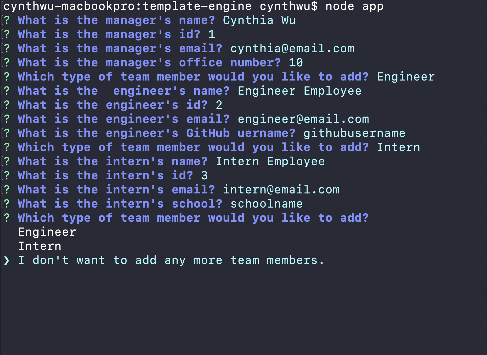
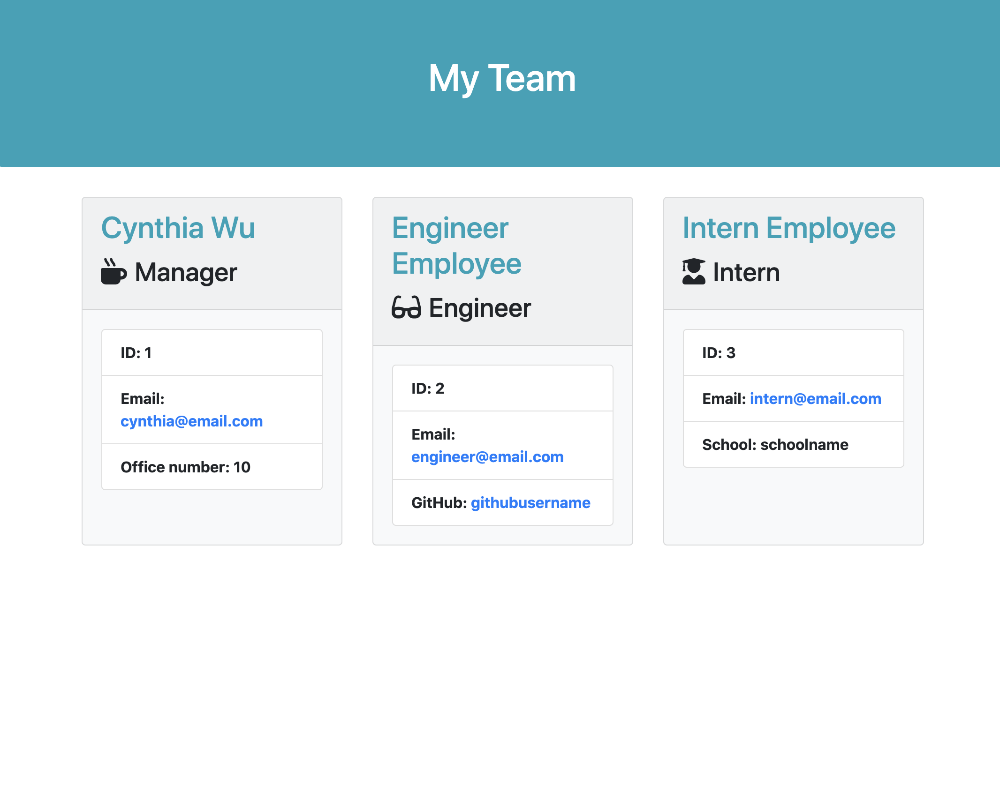

# Template Engine


Explore the [project page](https://github.com/cynthiwu/template-engine)

## Table of Contents
- [About The Project](#about-the-project)
    - [Built With](#built-with)
- [Installation](#installation)
- [Usage](#usage)
  - [Demo](#demo)
- [Contributing](#contributing)
- [License](#license)
- [Contact](#contact)


## About The Project

The goal of this project was to create a Node CLI that generates a work directory webpage based on user input. With this application, a user can enter a manager's information, and then add additional direct reports of this manager (i.e., Engineer & Intern).

<hr>



<hr>



<hr>

### Built With

This project was built using:

* JavaScript
* [Node.js](https://nodejs.org/api/fs.html)
* [Inquirer.JS](https://www.npmjs.com/package/inquirer)
* [Bootstrap](https://getbootstrap.com/)
* [Font Awesome](https://fontawesome.com/)

## Installation

To get a local copy up and running, follow these simple steps:

1. Clone the repo
```sh
git clone git@github.com:cynthiwu/template-engine.git 
```

2. Install NPM packages (i.e., Inquirer.js)
```sh
npm install
```

## Usage

This project can be used as the foundation for an employee directory of a given company. To use this product, the user should follow the below steps:

1. With the project director open, enter the below prompt into the CLI:

```sh
node app
```

2. When prompted, enter the manager's name, ID, email, and office number. 

3. Once manager information has been entered, select an additional employee to add to the directory:
  - For Engineer, enter the Engineer's name, ID, email, and GitHub username.
  - For Intern, enter the Engineer's name, ID email, and school.

4. Once finished entering additional employees, select "I don't want to add any more team members."

5. An "output" directory will be created and a "team.html" file, containing the user-entered information, will be inserted. 

### Demo

Watch the video below to see how the quiz works.


Click the following link below to view this demo on YouTube:
[Template Engine Demo](https://youtu.be/8mVkqX1YHsw)

## Contributing

Contributions are what make the open source community such an amazing place to  learn, inspire, and create. Any contributions you make are **greatly appreciated**.

1. Fork the Project
2. Create your Feature Branch (`git checkout -b feature/AmazingFeature`)
3. Commit your Changes (`git commit -m 'Add some AmazingFeature'`)
4. Push to the Branch (`git push origin feature/AmazingFeature`)
5. Open a Pull Request

## License

None

## Contact

Cynthia Wu - [@cynthia21wu](https://twitter.com/cynthia21wu) - cynthia21wu@gmail.com

Project Link: [https://github.com/cynthiwu/readme-generator](https://github.com/cynthiwu/template-engine)
